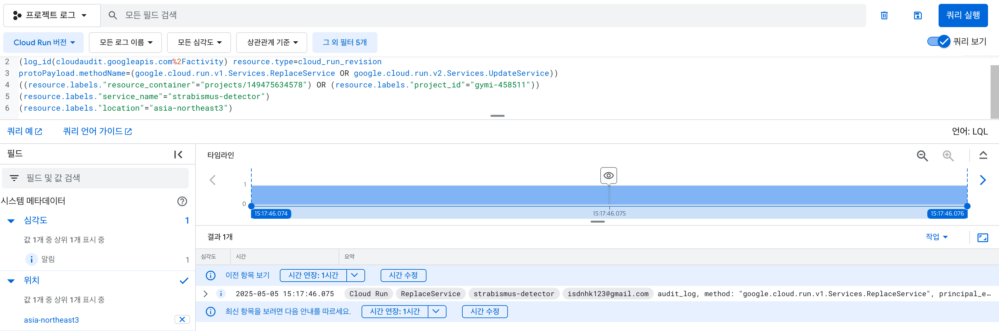

# Strabismus Detector - Cloud Run Version

## 📸 Production Deployment Evidence

The project was successfully deployed to Google Cloud Run in May 2025, demonstrating real-world cloud deployment experience:



*Screenshot showing the strabismus-detector service deployed on Google Cloud Run (asia-northeast3 region) on May 5th, 2025 at 15:17:46 KST*

---

## 📋 Project Overview

A production-ready medical AI system for **strabismus (squint-eye) detection and classification**, built with modern cloud-native architecture and deployed on Google Cloud Run.

### 🔬 Core Technology
- **AI/ML**: TensorFlow-based image classification model for medical diagnosis
- **Backend**: FastAPI with comprehensive error handling and validation
- **Frontend**: React-based patient management system
- **Cloud Infrastructure**: Google Cloud Run with automated CI/CD pipeline
- **Storage**: Google Cloud Storage integration for medical image management

## 🛠️ Development Highlights

### Recent Enhancements (Latest Commits)
- **Production-Ready Backend** (`d29743f`, `10502fa`, `d86f13c`)
  - Robust error handling with try-catch patterns
  - Health check endpoints for monitoring
  - Environment variable-based configuration
  - CORS optimization for deployment flexibility

- **Cloud Infrastructure** (`fd94ded`, `6fc0c17`, `12ebd4f`)
  - Automated Cloud Build pipeline with `cloudbuild.yaml`
  - Interactive deployment script with validation checks
  - IAM policies for public API access
  - Docker optimization for Cloud Run deployment

- **Google Cloud Storage Integration** (`2ff7bf7`, `f7f4852`)
  - Custom CloudStorageClient class for medical image management
  - Support for OpenCV image uploads and memory-based transfers
  - Automatic filename generation with timestamps
  - Proper cleanup and resource management

- **Development Environment** (`21e1166`)
  - Updated Docker configuration for Cloud Run compatibility
  - Environment-based port configuration (PORT=8080)
  - OpenCV system dependencies for image processing

### 🎯 Key Features Implemented
1. **Medical Image Processing**: OpenCV-based eye detection and cropping
2. **AI Diagnosis**: 5-class strabismus classification (esotropia, exotropia, hypertropia, hypotropia, normal)
3. **Cloud Storage**: Seamless integration with Google Cloud Storage
4. **Production Monitoring**: Health checks and comprehensive logging
5. **Automated Deployment**: One-command deployment with `./deploy.sh`

## 🧠 About

An end-to-end machine learning project to let people test for **strabismus** (squint-eye) and recognize the type of condition.
The image classification model is built using **TensorFlow**, with a backend developed in **FastAPI** and a frontend using **React**.

## 🚀 Architecture & Deployment

This project demonstrates modern cloud-native development practices:
- **Containerized Deployment**: Docker-optimized for Google Cloud Run
- **CI/CD Pipeline**: Automated build and deployment with Cloud Build
- **Scalable Storage**: Google Cloud Storage for medical image management
- **Production Monitoring**: Health checks and error handling

## 🏗️ Deployment (Google Cloud Run)

### 1. Build the image
```bash
gcloud builds submit --tag gcr.io/YOUR_PROJECT_ID/strabismus-detector

